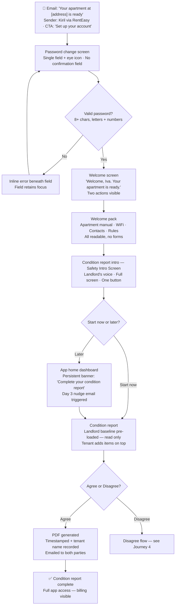
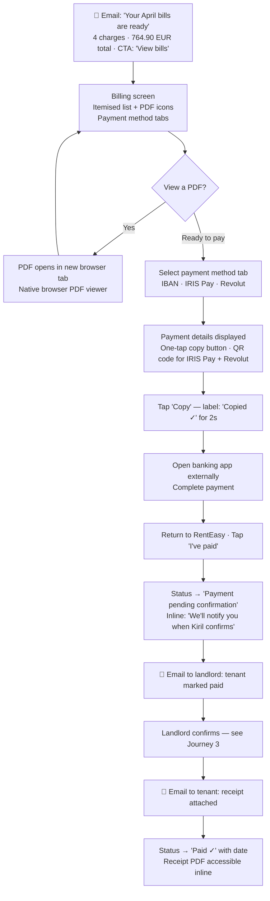
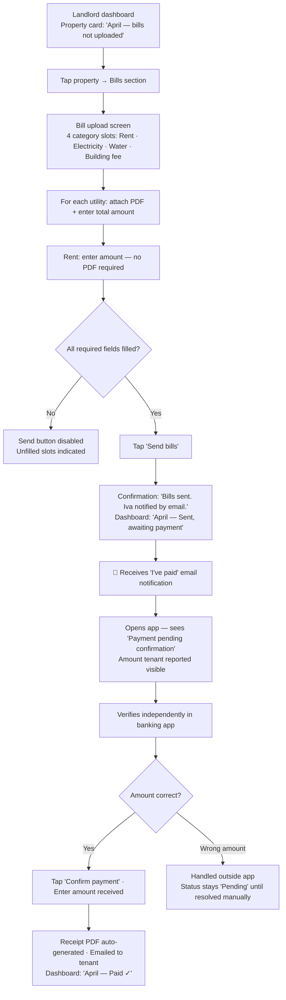
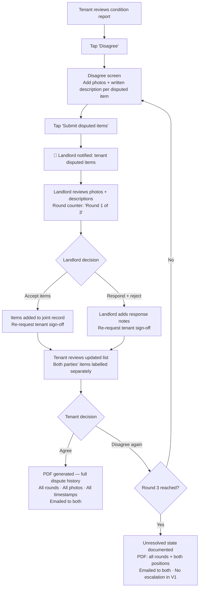
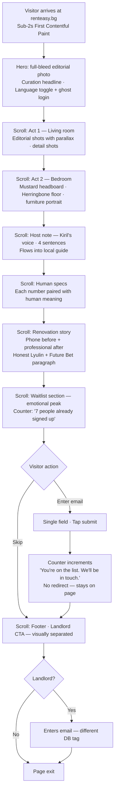
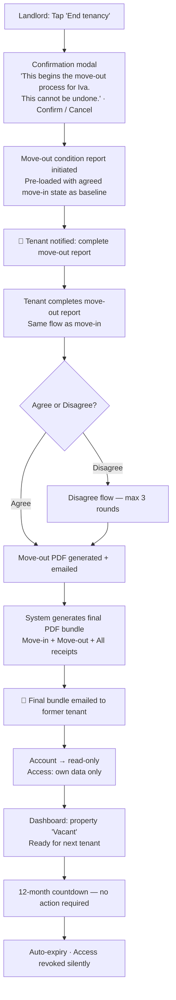

# UX Design Specification RentEasyV2

**Author:** Kiril
**Date:** 2026-04-04

---

<!-- UX design content will be appended sequentially through collaborative workflow steps -->

## Executive Summary

### Project Vision

RentEasy (renteasy.bg) is the first transparency-first rental management platform in the Bulgarian market — a mobile-first web application that treats billing clarity and tenant dignity as the product, not features. It starts as a personal tool for one landlord and one apartment in Sofia, architected from day one to support multiple landlords and properties without rewrites.

The core product promise is precise and measurable: tenants understand exactly what they are paying for every month, with itemised charges and attached utility bill PDFs, through a professional experience neither landlords nor tenants in Bulgaria have had access to before. V1 success is binary — zero "what am I paying for?" messages per billing cycle.

### Target Users

**Landlord — Kiril (V1) / Private Bulgarian Landlords (V2+)**
Private landlord in Sofia managing 1–3 properties over 2–3 years. Technically capable, detail-oriented, wants to run rentals professionally without it becoming a second job. Target: under 15 minutes per month on billing administration. Values doing things properly and treating tenants as adults.

**Tenant — Bulgarian Renters 25–45**
Digitally comfortable, Viber users, accustomed to opaque billing from previous landlords — a total amount, no breakdown, sent whenever. May include expats (English fully supported). Mobile is their primary device. Trust is established offline before the app is ever opened; the credential email arrives expected, not cold.

### Key Design Challenges

1. **Dual-role, dual-experience product** — Landlord and tenant never see the same screens. The landlord experience must be efficient (admin tool: fast, task-oriented). The tenant experience must feel professional (consumer product: clear, reassuring, well-crafted). These require different design registers within a single coherent visual system.

2. **Condition report emotional reframe** — The most legally significant moment in the tenancy is also the most anxiety-inducing. The UX challenge is converting "this looks like a trap" into "this is protecting me." The Safety Intro Screen, the landlord pre-loading dispute-prone items before tenant first login, and the tenant-layer-on-top model are the mechanisms — the UX must execute this precisely and without friction.

3. **Money must feel safe** — The billing screen is where trust is built or broken every month. The one-screen bill layout, inline PDFs, one-tap payment detail copy, "I've paid" tenant action, and the receipt confirmation moment must all feel certain, visible, and confirmed — never uncertain or buried.

4. **Showcase page as two products in one** — Serving potential tenants (waitlist) and future platform landlords (interest capture) from a single editorial page, without either audience feeling the other one is present. The landlord CTA must be present but invisible to the wrong audience.

### Design Opportunities

1. **First tenant-centric rental platform in Bulgaria** — No competitor has deliberately occupied this UX space. The tenant-first design principle ("every piece of friction should feel like it's protecting the tenant, never serving the landlord") is a genuine competitive differentiator, not a tagline.

2. **Visual language as end-to-end trust signal** — The same typographic care, palette, and intentionality that defines the showcase page must carry through into the authenticated app. Most rental products look nothing like their marketing sites. Continuity here signals that the same person who designed the showcase page also cared about the billing screen.

3. **Condition report as relationship foundation** — The move-in condition report is the highest-leverage UX moment in the entire product. Done right, it sets the emotional tone for the whole tenancy. A tenant who finishes the condition report feeling protected — not trapped — will trust the landlord for the duration of their stay.

## Core User Experience

### Defining Experience

RentEasy has two core loops that must be individually excellent:

**The Monthly Billing Loop (tenant-facing heartbeat):** Tenant views itemised bill with attached utility PDFs → selects payment method → taps one-tap copy to get payment details → pays externally → taps "I've paid" → status updates → landlord confirms → receipt arrives by email. Every step of this loop must be visible, certain, and free of ambiguity. The moment any step feels unclear, the tenant sends a Viber message — which is the product's failure state.

**The Landlord Admin Loop (landlord-facing heartbeat):** Upload utility PDF + enter amount per category → hit send → receive "I've paid" email notification → verify bank app → confirm in RentEasy → done. Under 15 minutes per month. Every screen the landlord touches is an admin tool: task-oriented, efficient, no ceremony.

### Platform Strategy

Web application only in V1 — the web app is the product on all devices. Designed at 390px (iPhone 14 / common Android baseline) first, adapted to tablet and desktop. Touch-primary: all interactions designed for tap, no hover-only patterns. No offline functionality required.

Two rendering contexts within the same product:
- **Showcase page** — statically pre-rendered at build time for SEO and performance; no authentication; scroll-driven editorial layout
- **Authenticated app** — server-rendered; mobile-first single-column layout with adaptive wider layout on tablet/desktop where it aids readability

### Effortless Interactions

These interactions must require zero thought:
- **Payment detail copy:** One tap copies IBAN, IRIS Pay phone number, or Revolut link to clipboard — no manual typing of financial details, ever
- **Bill PDF access:** Every uploaded utility bill PDF is accessible inline on the billing screen — one tap opens it, no navigation required
- **"I've paid" action:** Single button, single tap, status changes immediately. The tenant's confirmation action is a moment of psychological closure — it must feel decisive
- **Language switch:** Instant toggle between Bulgarian and English — no reload, no re-authentication
- **Condition report photo upload:** Standard file input — tenant or landlord attaches photos from their device's photo library or file system. No camera API, no special browser permissions. Works identically on mobile and desktop.

### Critical Success Moments

1. **The Safety Intro Screen (condition report):** The single screen that converts the most legally significant and anxiety-inducing interaction into the most trust-building one. The landlord telling the tenant how to protect themselves against the landlord. If this screen lands, the tenancy starts right.
2. **The Receipt Moment:** Landlord confirms payment → PDF receipt auto-generated → email arrives. This is the product's proof of value, repeated every month. It must feel like clockwork — immediate, complete, professional.
3. **The Showcase Page First Impression:** Full-screen editorial photo, sub-2 second load, no navigation clutter. Three seconds to communicate "this landlord is different." The entire acquisition function of the product lives here.
4. **First Login Sequence:** Password change → welcome pack → condition report intro. The transition from unknown email to trusted app happens in this flow. It must be seamless, warm, and build with each step.

### Experience Principles

1. **Every friction protects the tenant, never serves the landlord.** When a step adds resistance, the question to ask is: who does this friction protect? If the answer is "the landlord's admin convenience," remove it. If the answer is "the tenant's legal protection," keep it and frame it as such.
2. **One job per screen.** The billing screen shows the bill. The condition report intro screen explains protection. The receipt confirmation screen confirms the receipt. Screens that try to do more than one thing produce uncertainty — and uncertainty in a financial product destroys trust.
3. **Mobile-first is an architectural decision, not a visual one.** Every interaction is designed at 390px first. Desktop is an adaptation, not the primary canvas. Tap targets are 44px minimum. No hover states carry functionality.
4. **Visual continuity is a trust signal.** The same typographic care, palette, and intentionality that defines the showcase page must carry through into every authenticated screen. Continuity signals that the same level of care governs billing as governs marketing.
5. **The product's job is to make money feel safe.** Visible, confirmed, documented. A tenant who can see exactly what they owe, and receives a PDF receipt the moment they pay, never needs to ask a question.

## Desired Emotional Response

### Primary Emotional Goals

**For tenants:** Protected and clear. Every interaction in the app should produce one of two feelings — either "I am documented and safe" (condition report) or "I know exactly where I stand" (billing, payment status, history). The absence of confusion IS the product.

**For the landlord:** In control and efficient. The dashboard is the command view. Every action should feel decisive — upload, send, confirm, done. No second-guessing, no hunting for status.

**For showcase page visitors:** "This landlord is different." Not a feeling to be engineered through copy — it must be triggered by the design itself within three seconds of the page loading.

### Emotional Journey Mapping

**Tenant onboarding arc:** Recognition (credential email) → Competence (password change) → Delight (welcome pack) → Trust (condition report Safety Intro) → Safety (condition report completion). Five distinct emotional beats that must each land before the next begins.

**Monthly billing arc:** Clarity (bill view) → Certainty (payment details) → Closure ("I've paid") → Confirmation (receipt email). A complete emotional loop that repeats every month and must feel identical every time.

**Showcase arc:** Intrigue (hero image) → Desire (room reveals) → Recognition (host note) → Invitation (waitlist form).

### Micro-Emotions

- **Trust over scepticism** — the credential email is structurally similar to a phishing attack; it is neutralised by anchoring every element to something the tenant already knows (landlord name, apartment address)
- **Protection over entrapment** — the condition report must feel like a shield handed to the tenant, not a document designed to catch them out
- **Certainty over uncertainty** — "Payment pending confirmation" is an honest status; what it must never produce is "what does this mean? did it go through?"
- **Routine over anxiety** — the billing loop repeats every month; familiarity is a feature, not a limitation. Month 3 should feel identical to month 1.
- **Accomplishment over obligation** — completing the condition report, marking "I've paid," receiving the receipt — these are moments of closure, not bureaucratic checkboxes

### Design Implications

- **Protection → Safety Intro Screen copy** is written in the landlord's voice, tells the tenant explicitly how to protect themselves. Not legal language. Not corporate tone.
- **Clarity → One-screen bill layout** with inline PDFs. No navigation, no tabs, no "see attached." Everything visible on one scroll.
- **Certainty → "Payment pending confirmation"** status must display prominently and explain what happens next: "We'll notify you when Kiril confirms."
- **Closure → "I've paid" button** must be the largest, most prominent action on the billing screen. Primary action, primary visual weight.
- **Delight → Welcome pack** items should feel like gifts discovered, not forms to fill. Information-first, interaction-minimal.
- **Avoid anxiety → Day 3/7/14 nudges** start patient and warm; only the Day 14 soft block has firm language — and even then the copy keeps the relationship intact: "This protects you. 15 minutes."

### Emotional Design Principles

1. **The product's emotional job is to make the tenant feel safe, not to make the landlord look good.** The landlord looks good as a consequence of the tenant feeling safe.
2. **Familiarity is the goal of the monthly loop, not novelty.** Once the billing cycle feels routine, it has succeeded. Friction, surprise, or change in the monthly flow breaks trust.
3. **Every status must answer "what happens next?"** No UI state should leave a user wondering what the system will do, or what they need to do. Pending states, empty states, and loading states all carry forward guidance.
4. **Delight comes from information arriving before you knew to ask for it** — not from animation, gamification, or celebration. The welcome pack, the landlord-pre-loaded condition report items, the instant receipt — these are the delight moments.

## UX Pattern Analysis & Inspiration

### Inspiring Products Analysis

**bunsa.studio + essiewine.com (aesthetic references for showcase page)**
Editorial-first web design where typography and whitespace are the primary design medium. Photography is given full-bleed space without competing UI chrome. Pages are single intentional journeys — no menu needed when scroll is the navigation. Restraint is the signal of quality: every element earns its place or it doesn't appear.

**Airbnb (editorial apartment presentation + trust at scale)**
Photo-first hierarchy where the listing photo is the product and everything else supports it. Human-voice host descriptions alongside structured specs. The host profile — face, name, short bio — humanises a financial transaction before money is ever discussed. Social proof integrated as visual texture, not a separate section.

**Revolut (financial clarity + transaction confirmation)**
Every transaction is immediately comprehensible: amount, what it's for, timestamp, status — visible at a glance. Tap-to-action produces immediate status feedback with no spinner ambiguity. The push notification is the emotional payoff of every transaction, not just information delivery.

**Monzo / N26 (receipt presentation + payment history as permanent record)**
"Payment confirmed" is a distinct visual state — unambiguous, amount, date — not just the absence of "pending." Transaction history feels permanent and retrievable, not a log to be exported. The archive is a trust feature.

**Notion (structured document building + pre-populated templates)**
Blank-form anxiety solved by pre-populated structure. Collaborative content where one contributor's additions are visually distinct from another's. Draft persistence removes the anxiety of a hard submission step — you work until you're ready, then confirm.

### Transferable UX Patterns

**Navigation patterns:**
- **Scroll as navigation (bunsa/essiewine → showcase page)** — no menu needed; the page is a single intentional journey from hero to waitlist form
- **Single-column mobile-first layout (Revolut/Monzo → app screens)** — one action per scroll position, no competing priorities

**Interaction patterns:**
- **Immediate status feedback on action (Revolut → "I've paid" tap)** — status changes the moment the button is tapped; no loading ambiguity
- **Pre-populated structure + add-on-top (Notion → condition report)** — landlord baseline reduces blank-form anxiety; tenant layer adds without replacing
- **One-tap clipboard copy (Revolut → payment details)** — IBAN, IRIS Pay number, Revolut link each have a single copy action; no manual typing

**Visual patterns:**
- **Confirmed vs. pending as distinct visual states (Monzo → payment status)** — "Paid", "Pending confirmation", "Unpaid" each have unambiguous visual treatment
- **Human voice alongside structured specs (Airbnb → showcase page specs)** — each apartment spec paired with its human meaning
- **Host/landlord introduction with personal voice (Airbnb → showcase page host note)** — name, tone, specificity before any transaction

### Anti-Patterns to Avoid

- **Airbnb information overload** — listing pages show everything because they must support every use case globally. RentEasy has one apartment and one story. Constraint is a feature; don't fill space because it exists.
- **Revolut feature density** — Revolut earns complexity through daily use and high user sophistication. The billing screen is used once a month. Simplicity serves the infrequent user better than capability.
- **Generic SaaS welcome email** — most onboarding emails try to explain the product, upsell features, and establish brand. The credential email has one job: get the tenant to first login. Everything else is noise.
- **Condition report as adversarial document** — the standard model puts one party's version in front of the other for sign-off. The joint-record model removes the adversarial frame before the first item is reviewed.
- **Celebration UX in a financial product** — confetti, achievement badges, and gamification patterns produce tonal dissonance in a billing and legal document product. Confirmation, not celebration.

### Design Inspiration Strategy

**Adopt directly:**
- Scroll-driven single-journey showcase page (bunsa/essiewine) — no adaptation needed, this is the exact register
- One-tap clipboard copy for payment details (Revolut) — implement exactly as Revolut does it
- Distinct visual states for payment status (Monzo) — confirmed / pending / unpaid each need unambiguous treatment

**Adapt for RentEasy:**
- Airbnb host profile → host note on showcase page: shorter, more personal, no photo required in V1; the voice matters more than the image
- Notion collaborative editing → condition report: adapt the "pre-populated structure" pattern, but make the visual distinction between landlord and tenant items explicit with labels, not just styling
- Monzo permanent record → payment history: same philosophy (history as trust feature), adapted to show bill PDFs inline rather than just transaction amounts

**Avoid entirely:**
- Feature-dense dashboards (complexity before it's earned)
- Onboarding flows that sell rather than deliver
- Any UX pattern that positions the condition report as the landlord's document rather than a joint record

## Design System Foundation

### Design System Choice

**Hybrid approach: Custom Tailwind (showcase page) + shadcn/ui (authenticated app)**

The two surfaces in RentEasy have fundamentally different design requirements. The showcase page is a single editorial marketing page that must look hand-crafted — no component library produces the aesthetic required. The authenticated app (billing, condition reports, maintenance, onboarding) is a professional tool that benefits from a reliable, accessible component foundation.

### Rationale for Selection

**Showcase page — Custom Tailwind:**
- Full creative control over every visual decision; the editorial quality of bunsa.studio/essiewine.com cannot be approximated with off-the-shelf components
- A single marketing page does not benefit from a component system — every section is one-of-a-kind by design
- Tailwind provides the utility layer; the design work is handcrafted on top

**Authenticated app — shadcn/ui:**
- Components are copied into the project, not imported as a package — no version lock-in, no breaking updates, full ownership
- Built on Radix UI primitives: accessibility (ARIA roles, focus management, keyboard navigation) is correct by default, providing WCAG 2.1 AA compliance without building it from scratch
- Tailwind-based: same styling system as the showcase page, enabling visual continuity across both surfaces
- Solo-developer-optimised: components are generated per-need, not installed wholesale; only what's used exists in the codebase
- Free, zero vendor dependency, native Next.js 15 App Router support

### Implementation Approach

- All showcase page sections built as bespoke Tailwind components — no shadcn/ui on the public-facing surface
- For authenticated app: generate shadcn/ui components on demand (Button, Input, Form, Dialog, Tabs, Table, Badge, Sheet) and theme them to match the showcase page palette and typography
- Single Tailwind config governs both surfaces — shared design tokens (colours, typography scale, spacing) defined once and used everywhere
- Bulgarian/English language toggle: next-intl handles string substitution; component library is language-agnostic

### Customization Strategy

- **Colour tokens**: defined in Tailwind config to match the apartment's palette (to be determined during visual design phase); applied consistently across showcase and app
- **Typography**: single type scale (likely a clean sans-serif pairing) defined once in Tailwind config; showcase page uses it editorially, app uses it functionally
- **shadcn/ui theming**: CSS variables override the default shadcn theme to match RentEasy's palette — no component-level style overrides needed
- **Component extensions**: any custom components not covered by shadcn/ui (condition report item card, billing line item, payment method selector) are built as Tailwind components following the same design token system

## Design Direction Decision

### Design Directions Explored

Six directions were generated and evaluated, all showing the billing screen (core tenant experience) with the apartment's extracted colour palette applied: Warm Minimal, Structured Cards, Bold Action, Soft & Warm, Compact Efficient, and Split Zones. Full interactive mockups saved at `_bmad-output/planning-artifacts/ux-design-directions.html`.

### Chosen Direction

**Direction 1: Warm Minimal**

Typography leads. Whitespace signals quality. Tab switcher keeps payment methods clean without additional screens. The single mustard CTA button is the only bold element on the screen — everything else recedes to let content breathe. Closest to the bunsa.studio/essiewine.com aesthetic register.

### Design Rationale

- Warm Minimal matches the emotional goals: calm, professional, trustworthy. It does not shout; it presents clearly.
- The tab switcher for payment methods is the right pattern for a web app — familiar from browser-native contexts, no native mobile APIs required.
- Single CTA per screen ("I've paid", "Agree", "Send bills") is both a design choice and a UX principle — one job per screen.
- The direction works across both surfaces: restrained enough for the billing portal, refined enough for the showcase page with Playfair Display headings added.

### Implementation Approach — Responsive Web App

RentEasy is a **web application**, not a native mobile app. The browser chrome is always present. All design decisions must work in a browser context at every breakpoint.

**Showcase page responsive behaviour:**
- **390px (mobile):** Full-bleed hero photo, single column, scroll-driven narrative, generous vertical spacing between sections
- **768px (tablet):** Same single-column flow, wider content, images at full viewport width
- **1280px (desktop):** Max-content width ~960px centred with generous left/right margin. Playfair Display headings scale up (64–80px). Parallax and scroll-driven transitions more pronounced.

**Landlord portal responsive behaviour:**
- **390px (mobile):** Single column, full-width content, top header with property name and account menu
- **768px (tablet):** Same structure, wider content area, some two-column layouts where useful (bill upload form)
- **1280px (desktop):** Left sidebar navigation (220px fixed) + right content area. Sidebar: Dashboard, Bills, Condition Report, Maintenance, Property Settings. Content max-width ~800px within the right pane.

**Tenant portal responsive behaviour:**
- **390px (mobile):** Single column, stacked sections, billing screen fills viewport
- **768px (tablet):** Centred content, max-width ~640px
- **1280px (desktop):** Centred single column, max-width ~680px. Billing content doesn't benefit from wide layout — extra space becomes margin, not more columns.

**Navigation pattern — web-aware:**
- **Showcase page:** No navigation. Logo left, `BG / EN` toggle + `Tenant login →` text link right. No menu, no hamburger.
- **Landlord portal desktop:** Persistent left sidebar, 220px. Logo at top, navigation links below, account/logout at bottom.
- **Landlord portal mobile:** Top header bar with page title centred, hamburger right (opens slide-in drawer — same links as sidebar).
- **Tenant portal desktop:** Horizontal top navigation bar with 4–5 links (Current Bill, History, Welcome Pack, Condition Report).
- **Tenant portal mobile:** Top header, content below. Contextual back links rather than a hamburger — tenant portal has fewer sections.

## User Journey Flows

### Journey 1: Tenant Onboarding — First Login to Condition Report Complete

The highest-stakes first-time sequence. Five emotional beats must land in order: Recognition → Competence → Delight → Trust → Safety.

**Screen sequence:**

| Screen | Mobile | Desktop |
|--------|--------|---------|
| Password change | Full-width card, single field centred | Centred card max-width 440px |
| Welcome screen | Full viewport, warm greeting, two CTAs | Constrained to 680px |
| Welcome pack | Scrollable info cards | Two-column info grid within 680px |
| Safety Intro | Full-screen, large type, one button | Full browser viewport feel |
| Condition report | Single column, items stack | Single column, max-width 720px |

---

### Journey 2: Monthly Billing Loop — Tenant Side (Core Experience)

The heartbeat. Must feel identical every month.

**Key UX rules:**
- "I've paid" button: full-width, mustard `#C8952A`, minimum 52px height, always reachable without scrolling on mobile
- Payment tab switcher: IBAN selected by default
- QR code: rendered client-side, no server round-trip, no perceptible delay
- Status badge: always visible at top of billing screen — "Unpaid" / "Pending confirmation" / "Paid ✓"

---

### Journey 3: Monthly Billing Loop — Landlord Side

---

### Journey 4: Condition Report — Disagree Flow

**Visual rules:** Round counter is factual, never alarming — neutral colour, not red. Unresolved state at round 3 is framed as documentation, not failure.

---

### Journey 5: Showcase Page — Tenant Conversion

**Ghost login:** Top-right, text only "Tenant login →". Sticky on desktop header. Present in hero area on mobile. 12px Inter, no button treatment.

---

### Journey 6: Move-Out — End of Tenancy

---

### Journey Patterns

**Entry patterns:**
- Email CTAs always land directly on the relevant screen — never on a generic dashboard
- App-direct entry shows the most current/relevant state first (current month's bill, not a month list)

**Progress patterns:**
- Multi-step flows show whose turn it is: "Waiting for Kiril" / "Your turn to review"
- Round counters shown as "Round X of 3" — factual, never alarming

**Feedback patterns:**
- Copy actions: label changes to "Copied ✓" for 2 seconds, then reverts — no toast, no modal
- Form submissions: inline confirmation replacing the form — no full page reload
- PDF generation: immediate; skeleton placeholder only if over 2 seconds

**Error patterns:**
- Password validation: inline beneath field, on blur — not on submit
- File upload failures: inline message with retry — never a modal
- Network errors: banner at top of screen with retry — content remains visible below

### Flow Optimisation Principles

1. **Email CTAs land directly on the task** — never on a generic dashboard requiring a second navigation step
2. **Status is always visible before action** — billing screen shows payment status before the user scrolls to the CTA
3. **Every waiting state explains what happens next** — "Pending confirmation" is always followed by "We'll notify you when Kiril confirms"
4. **Only one destructive action requires a confirmation modal** — move-out trigger. Payment confirmation and condition report agreement are desired outcomes, not destructive.
5. **The disagree flow caps anxiety** — round counter is information, never a warning; unresolved state at round 3 is documentation, not failure

## Component Strategy

### Design System Components

shadcn/ui provides the foundational interactive primitives. All components are copied into the project codebase (not imported as a package), themed via CSS variables to match the RentEasy palette, and extended where needed.

**Core shadcn/ui components in use:** Button, Input, Form, FormField, FormLabel, FormMessage, Tabs, TabsList, TabsTrigger, TabsContent, Badge, Dialog, AlertDialog, Sheet, Skeleton, Separator, ScrollArea.

**Theming overrides applied to shadcn/ui defaults:**
- Primary: `#4A6172` (replaces default blue)
- Accent/CTA: `#C8952A` (mustard — applied to primary Button variant)
- Background: `#F8F4EE` (warm off-white)
- Font: Inter throughout

### Custom Components

**1. BillLineItem**

- **Purpose:** Display a single charge line — category name, amount, optional PDF access
- **Usage:** Billing screen, billing history
- **Anatomy:** Category label (left) · Amount (right, bold) · PDF icon (far right, only when PDF attached)
- **States:** Default · PDF-attached variant · No-PDF variant (Rent)
- **Accessibility:** PDF link `aria-label="Open [category] bill PDF"`. Row is not tappable — no accidental navigation.

**2. PaymentMethodPanel**

- **Purpose:** Display IBAN, IRIS Pay, or Revolut payment details with one-tap copy and QR code
- **Usage:** Billing screen, inside Tabs component
- **Anatomy:** IBAN tab: account number + copy button · IRIS Pay tab: phone + copy + QR · Revolut tab: link + copy + QR
- **States:** Default · Copied (button label → "Copied ✓" for 2 seconds, then reverts)
- **Interaction:** `navigator.clipboard.writeText()`. No toast — inline label change only.
- **Accessibility:** Copy buttons have specific `aria-label` per method. QR codes have descriptive `alt` text.

**3. PaymentStatusBadge**

- **Purpose:** Communicate current payment state with colour and text
- **Usage:** Billing screen header, billing history, landlord dashboard
- **States:** Unpaid (`#B87A1A` on amber tint) · Pending confirmation (same amber) · Paid ✓ (`#3D7A5F` on green tint)
- **Accessibility:** Never colour-only — always includes text label.

**4. ConditionReportItem**

- **Purpose:** Display a single condition report item with photo(s), description, and contributor label
- **Usage:** Condition report screen
- **Anatomy:** Contributor label ("Landlord" / "You") · Photo thumbnail(s) · Description · Timestamp
- **States:** Landlord item (read-only for tenant) · Tenant item (editable during active round)
- **Variants:** Compact list view · Expanded detail view

**5. ConditionReportRoundBanner**

- **Purpose:** Show whose turn it is to act and which dispute round is active. Factual, never alarming.
- **Usage:** Top of condition report screen during active dispute
- **Anatomy:** Round indicator ("Round 2 of 3") · Actor label ("Your turn" / "Waiting for Kiril")
- **States:** Tenant's turn · Landlord's turn · Waiting · Unresolved (calm, not an error state)
- **Accessibility:** `role="status"` — screen readers announce changes.

**6. SafetyIntroScreen**

- **Purpose:** Full-screen condition report intro. The highest-leverage UX moment in the product.
- **Usage:** Condition report entry on first login only
- **Anatomy:** Large headline ("This report protects you.") · 2–3 sentences in landlord's voice · Single primary button ("Start the report")
- **Accessibility:** Headline is `<h1>`. No auto-advance. Full contrast on warm background.

**7. WelcomePackSection**

- **Purpose:** Display a single section of the tenant welcome pack
- **Usage:** Welcome pack screen (multiple instances stacked)
- **Anatomy:** Section title · Content (text, key-value pairs for WiFi/contacts, or list)
- **Variants:** Text section · Key-value section · List section
- **Accessibility:** Copy buttons include `aria-label`. Collapsed sections use `aria-expanded`.

**8. FileUploadArea**

- **Purpose:** Accept photo or PDF file attachments
- **Usage:** Condition report (photo upload) · Bill management (PDF upload per category)
- **Anatomy:** Drop zone with dashed border · Instruction text · "Choose file" button · Attached file preview + remove button
- **States:** Default · Drag-over (desktop) · File attached · Upload error
- **Variants:** Photo (JPEG/PNG, multiple files) · Document (PDF, single file)
- **Accepted types:** Validated by MIME type + file signature server-side. `accept` attribute on input client-side.

**9. PendingActionBanner**

- **Purpose:** Persistent non-dismissible reminder to complete the condition report
- **Usage:** App dashboard when condition report is incomplete
- **Anatomy:** Message with day indicator ("Day 7 of 14") · "Complete now" action button
- **States:** Day 3–6 (soft tone) · Day 7–13 (firmer) · Day 14 (soft-block — replaces normal content)
- **Accessibility:** `role="alert"` on Day 14 version.

**10. QRCodeDisplay**

- **Purpose:** Render a QR code client-side for IRIS Pay and Revolut
- **Usage:** Inside PaymentMethodPanel
- **Implementation:** Client-side via `qrcode` npm package — no server round-trip, no network dependency
- **Accessibility:** `role="img"` with descriptive `aria-label`.

**11. ShowcaseWaitlistForm** *(showcase page only)*

- **Purpose:** Email capture with live counter. Primary conversion mechanic on the showcase page.
- **Usage:** Showcase page waitlist section and footer landlord CTA
- **Anatomy:** Counter ("7 people already signed up") · Email input · Submit button · Post-submit inline confirmation
- **States:** Default · Submitting (button disabled) · Submitted (counter increments, confirmation replaces form)
- **Variants:** Tenant waitlist (primary) · Landlord interest (footer — same mechanic, different label and DB tag)

### Component Implementation Strategy

All custom components built using Tailwind CSS utility classes with the shared design token system. shadcn/ui primitives used as base where applicable. No external component libraries beyond shadcn/ui.

### Implementation Roadmap

**Phase 1 — Core billing loop:**
`BillLineItem` · `PaymentMethodPanel` · `QRCodeDisplay` · `PaymentStatusBadge` · shadcn/ui: Button, Tabs, Skeleton

**Phase 2 — Condition report:**
`ConditionReportItem` · `SafetyIntroScreen` · `ConditionReportRoundBanner` · `FileUploadArea` · `PendingActionBanner`

**Phase 3 — Onboarding + portal polish:**
`WelcomePackSection` · shadcn/ui: Sheet (mobile nav drawer), Dialog (move-out confirmation modal)

**Phase 4 — Showcase page:**
`ShowcaseWaitlistForm` · All showcase page sections (bespoke Tailwind — no component system)

## Defining Core Experience

### 2.1 Defining Experience

The defining interaction for RentEasy is the monthly billing screen.

> "See exactly what you owe this month — with every bill attached — and pay it without sending a single message."

This is the interaction that repeats every month, validates the product's core value, and is what tenants will describe when they tell someone about RentEasy. The condition report, welcome pack, and maintenance flows are important — but the billing loop is the heartbeat.

For the landlord, the mirror: upload bills, send in one click, confirm when paid. Under 15 minutes per month.

### 2.2 User Mental Model

Current reality: a Viber message with a total amount and a due date. No breakdown, no PDFs, no record. The mental model tenants bring is that billing will involve confusion and a follow-up question. RentEasy's job is to make the question never form — not to answer it better.

Current tenant workarounds: screenshotting Viber messages as payment proof, asking the landlord to forward utility bill PDFs by email, keeping private notes on monthly payments. RentEasy makes every workaround unnecessary by design.

### 2.3 Success Criteria

- Tenant opens billing screen and understands every line item without asking a question
- Tenant can view the underlying utility bill PDF in one tap from the billing screen
- Payment details (IBAN / IRIS Pay / Revolut) are copied to clipboard in one tap — no manual typing of financial details
- "I've paid" produces immediate, unambiguous status change with clear next-state guidance
- Receipt arrives by email within minutes of landlord confirmation
- Full billing history accessible — every receipt, every bill PDF — within 3 taps from any screen

### 2.4 Novel UX Patterns

**Novel for the Bulgarian rental market:**
- Bill line items + attached PDFs + payment methods + tenant confirmation action — all on one screen. No local competitor does this.
- "I've paid" as a tenant-initiated timestamped action: creates a paper trail that previously did not exist in the Bulgarian private rental context.

**Established patterns used:**
- One-screen transaction detail (Revolut/Monzo): familiar to the target audience
- One-tap clipboard copy: already second nature to Revolut users
- Payment QR codes (IRIS Pay/Revolut): already part of users' banking app experience; RentEasy contextualises them to the specific bill

### 2.5 Experience Mechanics

**Tenant billing loop:**

| Stage | Action | System response |
|-------|--------|----------------|
| Initiation | Email CTA or dashboard badge | Lands on billing screen for current month |
| View | Scroll billing screen | Itemised list with amounts; PDF icon per line |
| PDF | Tap PDF icon | Bill PDF opens in browser |
| Pay | Tap payment method (IBAN / IRIS Pay / Revolut) | Details + QR displayed; copy button per item |
| Copy | Tap copy button | "Copied ✓" visual feedback for 2 seconds |
| Confirm | Tap "I've paid" | Status → "Payment pending confirmation"; inline guidance shown |
| Receipt | Email arrives post-landlord confirmation | Status → "Paid ✓"; receipt PDF accessible inline |

**Landlord billing loop:**

| Stage | Action | System response |
|-------|--------|----------------|
| Upload | Select month → upload PDF + enter amount per category | File saved; amount recorded |
| Send | Tap "Send bills" | Tenant notified by email; dashboard shows "Sent, awaiting payment" |
| Notified | Receives "I've paid" email | Opens app; sees payment pending |
| Confirm | Tap "Confirm payment" | Receipt PDF generated; emailed to tenant; status → "Paid ✓" |

## Visual Design Foundation

### Color System

Derived directly from the apartment's interior palette. The design system uses the same materials and tones as the space it represents — blue-grey walls become the primary brand colour, warm oak grounds the warmth, mustard accent is used once and used decisively.

| Token | Hex | Usage |
|---|---|---|
| `--color-bg` | `#F8F4EE` | Page and app backgrounds |
| `--color-surface` | `#FFFFFF` | Cards, modals, form containers |
| `--color-primary` | `#4A6172` | Brand colour, navigation, links, borders |
| `--color-accent` | `#C8952A` | Primary CTAs: "I've paid", waitlist submit, key actions |
| `--color-oak` | `#C4955A` | Decorative accents, section dividers, showcase details |
| `--color-text` | `#1E1E1E` | Primary body text |
| `--color-muted` | `#6B7280` | Labels, secondary text, metadata |
| `--color-success` | `#3D7A5F` | "Paid ✓" status, completed states |
| `--color-pending` | `#B87A1A` | "Payment pending confirmation" status |
| `--color-error` | `#C0392B` | Error states, validation messages |
| `--color-stone` | `#3A3D42` | Dark accents, bathroom/stone texture reference |

**Rationale:** Blue-grey (`#4A6172`) as brand primary reads as calm, professional, and trustworthy — matching the apartment's dominant wall tone. Mustard (`#C8952A`) as the single accent creates a warm, decisive CTA against neutral backgrounds without aggression. The warm off-white background (`#F8F4EE`) connects to the cream walls in the apartment, giving the app the same warmth as the finished space.

### Typography System

Both fonts have full Cyrillic character sets — non-negotiable for Bulgarian primary language support.

**Display / headings: Playfair Display**
Editorial serif with strong Cyrillic coverage. Used for showcase page hero text, section headers, and feature headlines. Creates the editorial register of bunsa.studio/essiewine.com references. Not used in the authenticated app — reserved for the public-facing surface.

**Body / UI: Inter**
Exceptional Cyrillic readability at all sizes. Highly legible at 14–16px on mobile. Used throughout the authenticated app for all UI text, labels, and body copy. Used for body text, specs, and supporting copy on the showcase page.

**Type scale:**

| Level | Size | Weight | Usage |
|---|---|---|---|
| Display | 48–72px | 700 | Showcase page hero headline |
| H1 | 32px | 700 | Page titles |
| H2 | 24px | 600 | Section headings |
| H3 | 18px | 600 | Card headings, screen titles |
| Body | 16px | 400 | Primary body text |
| Small | 14px | 400 | Labels, metadata, secondary info |
| Micro | 12px | 400 | Captions, legal text, timestamps |

Line height: 1.5 for body, 1.2 for display. Minimum body size: 14px on all screens.

### Spacing & Layout Foundation

- **Base unit:** 4px
- **Scale:** 4 / 8 / 12 / 16 / 24 / 32 / 48 / 64 / 96px
- **App screens:** 8px grid; 16px horizontal padding on mobile; moderate density appropriate for monthly review rather than daily data entry
- **Showcase page:** generous section spacing (64–96px between sections); editorial breathing room signals quality
- **Grid:** Single-column on mobile (390px); two-column on tablet (768px) where layout aids readability (billing history, condition report); three-column on desktop (1280px) for dashboard overview

### Accessibility Considerations

- `--color-primary` `#4A6172` on `#FFFFFF`: contrast ratio 4.6:1 — passes WCAG AA for normal text
- `--color-accent` `#C8952A` on `#FFFFFF`: contrast ratio 3.1:1 — passes AA for large text (buttons ≥18px qualify as large text)
- `--color-text` `#1E1E1E` on `#F8F4EE`: contrast ratio 16.8:1 — passes AAA
- `--color-muted` `#6B7280` on `#FFFFFF`: contrast ratio 4.6:1 — passes AA
- `--color-success` and `--color-pending` are never used as the sole indicator of state — always paired with text labels
- All error states use text descriptions, not colour alone

## Responsive Design & Accessibility

### Responsive Strategy

RentEasy is a **web app, not a native mobile app.** The responsive strategy follows a strict mobile-first escalation model — designed at 390px, adapted upward. Extra screen real estate on desktop is used to reduce scroll, expose more context, and add sidebar navigation — never to change the fundamental task structure.

**Mobile (< 768px) — Primary surface, designed first:**
- Single-column layout throughout
- Full-width cards and form elements
- Hamburger + Sheet drawer navigation (both landlord and tenant portals)
- Bottom-anchored primary action buttons on modal/sheet overlays
- Billing screen: one bill item per row, full-width
- Condition report: one room/item per card, stacked vertically
- 16px horizontal page padding
- No hover-dependent interactions — all interactions work with tap only

**Tablet (768px – 1023px) — Transitional breakpoint:**
- Two-column layout for content-dense screens (billing history, condition report items, maintenance list)
- Top navigation replaces Sheet drawer for tenant portal
- Landlord sidebar remains as Sheet drawer (not enough room for persistent sidebar at this width)
- Increased padding: 24px horizontal
- Touch-optimised — no assumption of mouse precision

**Desktop (≥ 1024px) — Enhanced layout:**
- Landlord portal: persistent 220px left sidebar, content area fills remaining width
- Tenant portal: top navigation with horizontal nav items
- Two- or three-column grids for dashboard overviews
- Content max-width: 1280px, centred
- Showcase page: multi-column hero (text + image side-by-side), two-column features section
- Hover states active on desktop only — never the sole indicator of interactivity

---

### Breakpoint Strategy

Mobile-first with Tailwind CSS breakpoint prefixes:

| Breakpoint | Width | Tailwind prefix | Primary change |
|---|---|---|---|
| Mobile (default) | 0px+ | (none) | Single column, Sheet nav, compact spacing |
| Tablet | ≥ 768px | `md:` | Two-column content grids, top nav for tenant, 24px padding |
| Desktop | ≥ 1024px | `lg:` | Persistent landlord sidebar, three-column grids, hover states |
| Wide | ≥ 1280px | `xl:` | Content max-width cap, centred layout |

No custom breakpoints. Standard Tailwind `sm` (640px) is not used — the jump from 390px mobile to 768px tablet covers that range without a mid-point.

**Implementation rule:** All Tailwind classes are written mobile-first. `md:` and `lg:` modifiers add progressive enhancement. Never write desktop styles as base and override with mobile.

---

### Accessibility Strategy

**Target: WCAG 2.1 Level AA** — industry standard, legally defensible, achievable with shadcn/ui + Radix UI which implements AA by default for all interactive primitives.

**Colour contrast (verified in visual foundation):**
- `#1E1E1E` on `#F8F4EE`: 16.8:1 — AAA ✓
- `#4A6172` on `#FFFFFF`: 4.6:1 — AA ✓
- `#6B7280` on `#FFFFFF`: 4.6:1 — AA ✓
- `#C8952A` on `#FFFFFF`: 3.1:1 — passes AA for large text (≥18px or 14px bold); do not use for body text
- Status colours (`#22C55E`, `#3B82F6`, `#C0392B`) are never used alone — always paired with text labels

**Touch targets:**
- All interactive elements: minimum 44×44px tap area
- Spacing between adjacent tap targets: minimum 8px
- Achieved via Tailwind `min-h-[44px]` and `py-3` on buttons and list items

**Keyboard navigation:**
- All interactive elements reachable via Tab key
- Tab order follows visual reading order (left-to-right, top-to-bottom)
- Modal/Sheet dialogs trap focus while open and return focus to the trigger element on close (Radix UI handles this automatically)
- Skip-to-content link as the first focusable element on every page

**Focus indicators:**
- Visible focus ring on all interactive elements
- Tailwind `focus-visible:ring-2 focus-visible:ring-[#4A6172]` applied via shadcn/ui component defaults
- Never `outline: none` without a replacement focus indicator

**Screen reader support:**
- Semantic HTML throughout: `<nav>`, `<main>`, `<header>`, `<section>`, `<article>`, `<aside>`, `<button>`, `<a>`
- Page titles update on route change (Next.js `metadata` export)
- All images have `alt` text. Decorative images: `alt=""`
- Icon-only buttons include `aria-label`
- Status badges include `role="status"` for live payment/maintenance updates
- Form inputs associated with labels via `htmlFor` / `id` pairs — never placeholder-only
- ARIA live regions for toast notifications: `role="status" aria-live="polite"`
- Loading states: `aria-busy="true"` on the container being updated

**Language:**
- `<html lang="bg">` for BG locale, `<html lang="en">` for EN
- `lang` attribute updates dynamically on language toggle via `next-intl`

---

### Testing Strategy

**Responsive testing:**

| Test | Method |
|---|---|
| 390px mobile layout | Chrome DevTools device emulation (iPhone 14 Pro) |
| 768px tablet layout | Chrome DevTools at 768px width |
| 1280px desktop layout | Browser window at 1280px+ |
| Real device — iOS | Safari on physical iPhone (Safari 14+) |
| Real device — Android | Chrome on physical Android phone (Chrome 90+) |
| Touch target size | Chrome DevTools → Rendering → verify tappable areas |

**Accessibility testing:**

| Test | Method |
|---|---|
| Automated WCAG scan | axe DevTools browser extension on every screen before release |
| Colour contrast | WebAIM Contrast Checker for all colour pairs |
| Keyboard-only navigation | Tab through every screen without mouse |
| Screen reader — iOS | VoiceOver on iPhone (primary) |
| Screen reader — Android | TalkBack on Android |
| Colour blindness simulation | Chrome DevTools → Rendering → Emulate vision deficiencies |

**Performance:**
- Lighthouse score ≥ 90 on mobile for Performance, Accessibility, Best Practices
- Sub-2-second LCP on simulated 4G (Lighthouse mobile preset)
- CLS < 0.1 — all images have explicit width/height attributes

---

### Implementation Guidelines

**Responsive development:**
- Write all Tailwind classes mobile-first; `md:` and `lg:` modifiers for progressive enhancement
- Use `rem` for font sizes and spacing, `px` for borders and shadows only
- `min-h-[44px]` on all interactive elements
- `next/image` for all images: explicit `width` / `height`, `sizes` prop for responsive images
- Never use fixed `px` widths on content containers — use `max-w-*` with `w-full`
- Landlord sidebar layout: CSS Grid `grid-template-columns: 220px 1fr` on `lg:`, single column on mobile

**Accessibility development:**
- Skip link: `<a href="#main-content" className="sr-only focus:not-sr-only ...">Skip to main content</a>` as first element in `<body>`
- Icon-only buttons: always include `aria-label`; icon itself gets `aria-hidden="true"`
- Status badges: always pair colour with text label
- Form error messages: `role="alert"` so screen readers announce them immediately
- All shadcn/ui components use Radix UI primitives — do not override ARIA attributes or keyboard behaviour
- Test every new component with Tab key and VoiceOver before marking complete

## UX Consistency Patterns

### Button Hierarchy

Every interactive action uses a consistent visual weight system so users always know which action is primary and which is optional.

| Variant | Colour | Usage rule |
|---|---|---|
| Primary | `#4A6172` background, white text | One per screen. The single most important action: "Upload bill", "Mark as paid", "Agree to conditions". |
| Secondary | `#4A6172` border, `#4A6172` text, transparent bg | Supporting actions that complete but don't advance the main flow: "Download PDF", "View details". |
| Ghost | No border, `#4A6172` text | Destructive-adjacent or low-stakes actions: "Cancel", "Skip". |
| Destructive | `#C0392B` background, white text | Irreversible actions only: "Trigger move-out flow". Paired with AlertDialog confirmation. |
| Accent | `#C8952A` background, white text | One per product surface — used exclusively for the showcase page CTA ("Join Waitlist"). Never used inside the authenticated app. |

**Button loading state:** Replace button text with a spinner (`lucide-react` `Loader2` with `animate-spin`) and disable the button. Never remove the button or change its size while loading.

---

### Feedback Patterns

**Copy action (IBAN / IRIS phone / Revolut link):**
Button text changes from "Copy" → "Copied ✓" for 2 seconds using `useState` + `setTimeout`. No toast, no modal — inline confirmation is enough for a copy action. Uses `navigator.clipboard.writeText()`.

**Form submission:**
Disable submit button + show spinner immediately on submit. On success: navigate or show inline confirmation. On error: re-enable button + show error message below the form. Never use `alert()`.

**File upload (bill PDFs, condition report photos):**
Show upload progress via a linear progress bar below the input. On success: show filename + file size + a remove (×) icon. On error: show "Upload failed — try again" in `--color-error` below the input. Accepted formats: PDF (bills), JPEG/PNG (photos). Max file size: 10MB per file. Validate MIME type client-side and server-side.

**PDF generation:**
Show a full-width "Generating PDF…" banner or spinner while QuestPDF renders server-side. PDF downloads automatically when ready. If generation fails, show "PDF generation failed — please try again" with a retry button.

---

### Form Patterns

- **Validation timing:** On blur (when the user leaves the field). Never on every keystroke — this is anxiety-inducing. Show errors only after the user has attempted to fill the field.
- **Error display:** Inline below the field in `--color-error` (`#C0392B`), 14px Inter. The field border changes to `--color-error`. The error message disappears as soon as the value is corrected (on input).
- **Required fields:** No asterisks. All fields in V1 are required by default unless explicitly labelled "(optional)".
- **Password fields:** Eye icon (toggle visibility) on the right side of the input. Uses shadcn/ui `Input` with appended icon button.
- **Labels:** Always above the field, never placeholder-only. Placeholder text is an example value, never the label.
- **Cyrillic input:** No custom keyboard or special handling needed — OS handles Cyrillic input natively on all supported devices.

---

### Navigation Patterns

**Landlord — desktop (≥1024px):**
Fixed left sidebar, 220px wide. Logo top-left. Navigation items with `lucide-react` icons: Dashboard, Properties, Bills, Maintenance, Condition Reports, Settings. Active item: `--color-primary` background, white text. Collapsed state not needed in V1 — 220px fits comfortably.

**Landlord — mobile (<1024px):**
Top app bar: logo left, hamburger icon right. Hamburger opens a shadcn/ui `Sheet` (slide-in drawer from left) containing the full nav menu. Sheet closes on nav item tap or tap outside.

**Tenant:**
Top navigation bar, full width. Logo left, BG/EN language toggle right, account menu right. Navigation items as a horizontal row below the app bar on desktop; collapse into the same Sheet-from-hamburger pattern on mobile. Tenant has fewer nav items than landlord: Bills, Maintenance, Condition Report, Documents.

**Back navigation:**
Use the browser's native back navigation where possible. Where a custom back link is needed (deep-linked pages), show `← [Parent page name]` as a text link in `--color-primary` at the top of the content area — not a floating button.

**Showcase page:**
No navigation bar. "Tenant login →" as a ghost text link, top-right corner only. No hamburger, no menu. Scroll-only experience.

---

### Empty States

Each empty state includes an illustration space (reserved, SVG placeholder in V1), a heading, a supporting sentence, and a single action button.

| Screen | Heading | Supporting text | Action |
|---|---|---|---|
| Bills (no bills yet) | "No bills this month yet" | "Kiril will upload your monthly bills here. You'll get an email when they're ready." | — (no action for tenant) |
| Bills (landlord, no bills uploaded) | "No bills uploaded yet" | "Upload this month's utility bills to send them to your tenant." | "Upload bills" (primary) |
| Maintenance (no requests) | "No maintenance requests" | "Your tenant hasn't submitted any requests. Everything must be going well." | — |
| Maintenance (tenant, no requests) | "Nothing reported yet" | "If something needs attention in your apartment, submit a request here." | "Submit request" (primary) |
| Condition report (not started) | "Condition report not started" | "You have 14 days to review and confirm the apartment's condition." | "Start review" (primary) |
| Documents (no documents) | "No documents yet" | "Your receipts and condition reports will appear here once they're available." | — |

---

### Loading States

**Skeleton screens:**
Used for any data that must be fetched from the server before it can be displayed. Skeletons match the approximate shape and size of the content they replace. Use shadcn/ui's `Skeleton` component. Minimum display time: none — show skeleton immediately and hide it as soon as data arrives.

**Page-level loading:**
The Next.js `loading.tsx` file provides the skeleton for each route segment. No full-page spinners — skeleton screens only.

**Button loading:**
As described in Feedback Patterns above. The button never disappears or resizes.

**File upload progress:**
Linear progress bar (shadcn/ui `Progress`) below the file input. Updates in real time via upload progress events.

---

### Status Patterns

Three payment/process statuses are used across the app. Each has a colour, a label, and a supporting description. Colour is never the sole indicator — always accompanied by the text label.

| Status | Colour | Hex | Label (BG) | Label (EN) | When shown |
|---|---|---|---|---|---|
| Unpaid | Amber/Warning | `#C8952A` | Неплатено | Unpaid | Bill uploaded, tenant has not yet tapped "I've paid" |
| Pending confirmation | Blue/Info | `#3B82F6` | Изчаква потвърждение | Pending confirmation | Tenant has tapped "I've paid", Kiril has not yet confirmed |
| Paid | Green/Success | `#22C55E` | Платено | Paid | Kiril has confirmed payment in app |

Maintenance request statuses follow the same logic:

| Status | Colour | Hex | Label (EN) |
|---|---|---|---|
| Submitted | Blue | `#3B82F6` | Submitted |
| In progress | Amber | `#C8952A` | In progress |
| Resolved | Green | `#22C55E` | Resolved |

---

### Modal & Overlay Patterns

**AlertDialog (shadcn/ui):**
Used only for irreversible, high-stakes confirmations. In V1, the only AlertDialog is: **triggering the move-out flow**. Every other action either happens immediately (with undo-via-correction) or has sufficient confirmation built into the flow itself.

AlertDialog pattern: title (action being confirmed), one-sentence consequence description, "Cancel" (ghost) + confirm action (destructive red) buttons. Never use AlertDialog for deletions that are reversible or for minor confirmations.

**Sheet (shadcn/ui):**
Used for: mobile navigation drawer (slides from left), mobile payment detail panels (slides from bottom). Not used for confirmations or forms on desktop.

**Toasts:**
Used sparingly — only for transient success confirmations that don't warrant screen navigation and where inline confirmation is insufficient. Example: "Receipt emailed to tenant." Maximum one toast at a time. Auto-dismiss after 4 seconds. Position: bottom-center on mobile, bottom-right on desktop.

---

### i18n Patterns

- **Language toggle:** BG / EN switch in the top navigation bar. Persisted in `localStorage`. Default: BG.
- **Implementation:** `next-intl` with message files per locale (`messages/bg.json`, `messages/en.json`). All UI strings externalised — no hardcoded Bulgarian or English text in components.
- **Cyrillic:** Playfair Display and Inter both include full Cyrillic character sets. No fallback font needed.
- **Numbers and currency:** Use Bulgarian number formatting for BG locale (space as thousands separator, comma as decimal: `1 234,56 лв`). Use standard EU formatting for EN locale (`€1,234.56`). Post-eurozone: BGN display may be needed alongside EUR for legacy contracts — handle as a label change, not a currency conversion.
- **Dates:** Bulgarian locale uses `DD.MM.YYYY`. English locale uses `DD MMM YYYY` (e.g. "04 Apr 2026"). Use `date-fns` with locale-aware formatting.
- **No machine translation:** All translations are human-authored. Untranslated strings fall back to BG, not to a machine translation service.
- **Right-to-left:** Not applicable. BG and EN are both LTR.
